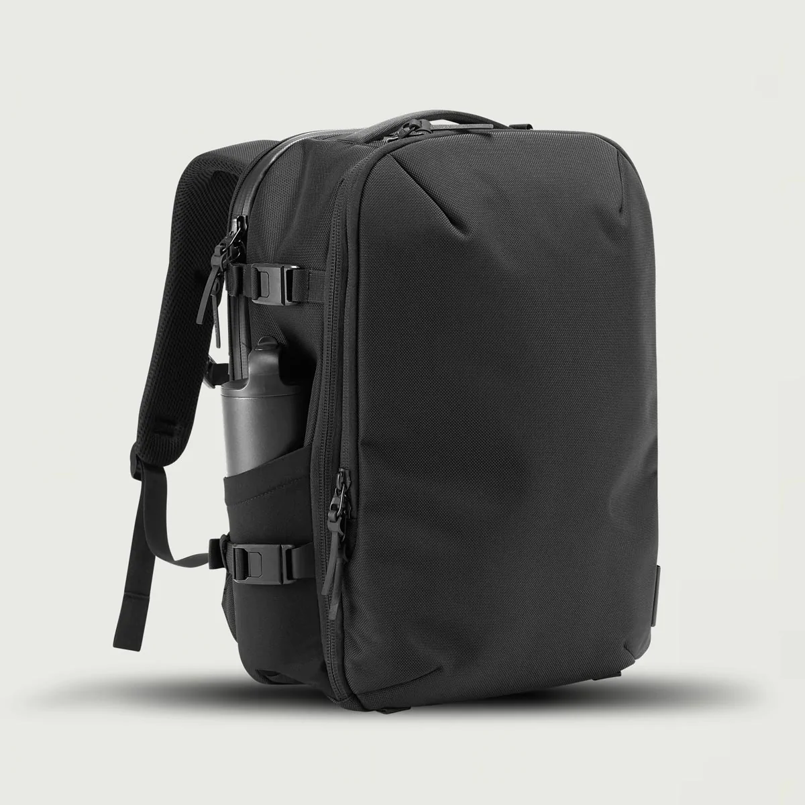
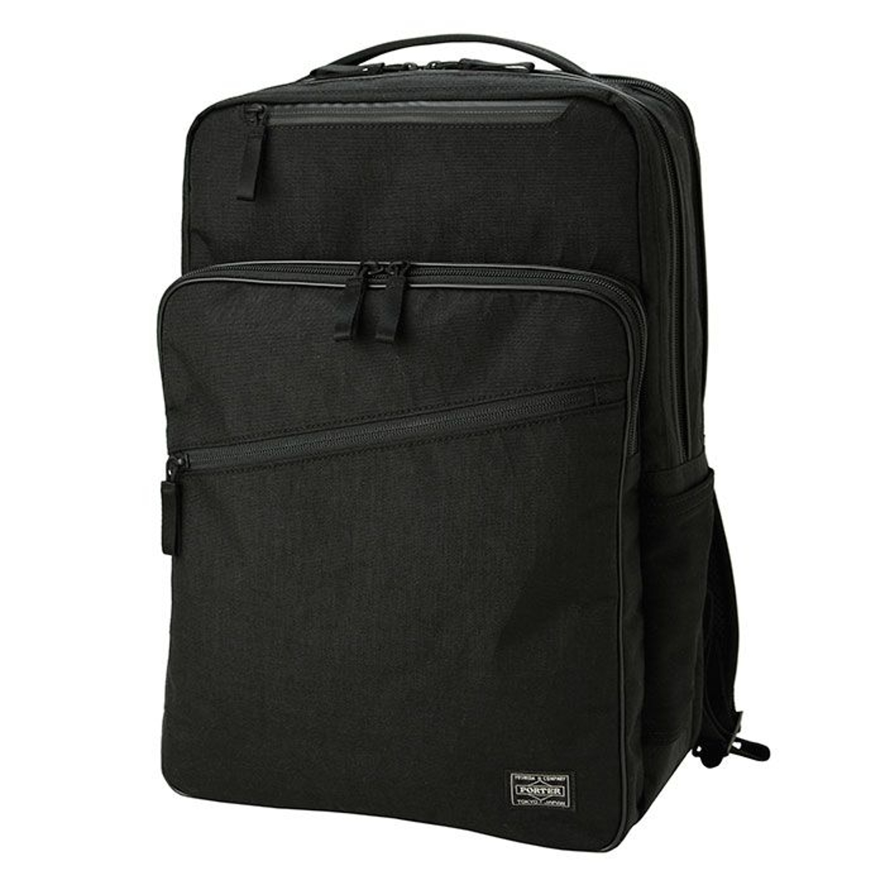

本記事は執筆途中です。  
そのため、**情報が間違っていたり、埋まっていなかったりという部分がたくさんあります。**

そんな状態の記事ですが、自分が外出先から確認できるようにしておきたいため、下書きではなく公開状態でWebに挙げています。

### 候補に入れたブランド・メーカー

* AER
* Wexley
* incase
* Porter
* サムソナイト
* tumi
* ブリーフィング
* アークテリアス
* エバーグッズ
* ピークデザイン
* ノースフェイス
* グレゴリー

### 実際に店頭で確認して感じたこと

 

image | brand | name | volume | weight | standing | waterproof | pockets | Laptop Safety| note
----- | ----- | ---- | :----: | :----: | :------: | :--------: | ------- | ------------ | ----
 | Aer | Day Pack 2 | 14.8 | ? | 完璧 | 完璧 x-pac生地 YKK AquaGuad | ラップトップx1 スマホサイズx4 ボトルx1（右） | 完璧 | 現在購入して使用中 豪雨の中で一度使用したが、全く浸水しなかった
 | Aer | Teck Pack 2 | 少ない 17 | ? | 完璧 | 安心 1680D コーデュラバリスティックナイロン YKK AquaGuad | ラップトップx2 スマホサイズx4 ボトルx1（右）| 完璧 | 生地が固いため衣類などの収納には不向きで、数値以上に収納力が無いように感じる Day Pack 2 で入らないものは Teck Pack でも入らないとのレビューが有り、Day Pack 2 を持っている前提ならこれを買うメリットは薄いと感じた
 | Aer | Fit Pack 3 | 18.7 | 1.1kg | ほぼ不可能 | 安心 1680D コーデュラバリスティックナイロン YKK AquaGuad | ラップトップx1 タブレットx1 スマホサイズx2 ボトルx2 | 完璧 | Gray は生地が異なる点に注意 モノが入っていない状態での自立は諦めた方がいい 背面が袋状になっているため、 数値以上の収納力がある 左右にボトルポケットがあるのはAERの中ではレア
 | BERMAS | Freelancer マルチパックL | volume | 1.3kg | 要検証 ノートパソコンだけ入れた場合の偏りなど もう少し検証が必要 | まあまあ安心 底面と前面コンパートメントには耐水性の高いPUコーティングと その他の部分は撥水加工のみ | ? | 良い | 生地が柔らかめなので、あまりモノが入っていない状態で自立するかどうかはきちんと確認したほうがいい
 | Wexley | ACE MULTIFUNCTION BACKPACK | 27 | 1.5kg / 1.75kg | しない 何も入っていない状態なら自立するが ラップトップを入れたら簡単に倒れる | waterproof | note
image | Wexley | Active Pack | 20 | ? | 不安 自立する個体としない個体がある | waterproof | かなり多い  ラップトップx1 タブレットx1 スマホサイズポケットx6 簡易アクセスx1  | 完璧 | 複数店舗で展示品を見たが、かなり安定して自立するものと、全く自立しないものがある 底面に折りジワがついてしまうと自立しなくなってしまう？ 「自立すること」を絶対条件にするなら、これを選ぶのはバクチになりそう
image | GREGORY | PLUG Day Pack v2 | volume | weight | standing | waterproof | 
image | incase | City Compackt Backpack （東急ハンズコラボモデル） | volume | weight | standing | waterproof | ? | 完璧 | City Back Pack と異なり、 メインコンパートメント内にラップトップポケットがある形となる PCだけを入れた状態では前方向に倒れてくるため、自立性能は厳しい
image | incase | City Backpack （東急ハンズコラボモデル） | 21 | 0.75kg | test | ? | ラップトップx2 スマホx4以上 ボトルx2 | ? | PC専用コンパートメントとメインコンパートメントに半分ずつマチが確保されているため、衣類などの柔らかいものの収納力は見た目ほど無いのが惜しい 両側にボトルポケットがあるのはかなり良い
 | Healthknit | 東急ハンズコラボ マザーズバッグ | volume | weight | 要検証 高いと思う | まあまあ 撥水加工のみ | pockets | 要検証 | 収納力やポケットの配分などかなり良さげだったのだが、ラップトップポケットが私のMacBook Pro 14 がギリギリ入らなかったのが惜しい おそらく MacBook Pro 13 を想定して設計したのだろう 自立性能やPC保護性能はMacBook Pro 14が入らなかった時点で検証しなかったため不明
 | Porter | Hybrid DAYPACK | volume | weight | まあまあ ラップトップしか入っていないと背中側に倒れてしまう | まあまあ X-C1000(x-pac コーデュラナイロン) しかし止水チャックでは無い | ラップトップx1 スマホサイズx2 外部ボトルx2 | 良い 吊り下げ式コンパートメント 吊り下げ位置が高い PCポケットの側面生地が薄いのはやや気になるか | x-pac生地を使用していることが特徴の Hybrid シリーズ せっかくx-pacを採用するなら止水チャックまで採用して欲しかったというのが本音 左右にボトルポケットがあるのはかなり良い
 | サムソナイト | プロデラックス5 | volume | weight | standing | waterproof | pockets | やや不安 吊り下げ式コンパートメント しかし底のクッションが薄い | 吊り下げ式コンパートメントだが、底のクッションが薄いため、勢いよくノートパソコンを入れると床に当たる感じがする 収納力は申し分ないのでそこだけが惜しい 吊り下げ式コンパートメントの下にクッションでも敷くか？
 | THE NORTH FACE | バサルトデイ | 25 | 1.145kg | 結構よい | まあまあ  | pockets | Laptop Safety| 25リットルという容量でありながら、ラップトップとガジェット類を放り込んでもきちんと自立する 同社の中で一番安定して自立するモデル 同社のローマーデイおよびボルダーパックは自立性能が弱い、 バサルトウィークエンダーは大きすぎる、と言う点で候補から外れた
 | サムソナイト | ジェット ビズ 2 バックパック エキスパンダブル ネイビー | volume | 1.1kg | standing | waterproof | pockets | Laptop Safety| 6cm の自立に対応しているので、普段はスマート、荷物が増えたら一気に拡張、ができる 自立、収納力がどのぐらい広がるかはもう少し検証が必要そう 
 | AER | City Pack Pro | volume | weight | standing | waterproof | pockets | Laptop Safety | x-pac生地はコーデュラよりも固い生地のため、自立しやすいという印象を受けた しかし公式では自立するとは言われていないため、自立しなくても自己責任
image | tumi | サーチ | volume | weight | standing | waterproof | pockets | Laptop Safety| note
image | tumi | Esports プロ・ラージ・バックパック | volume | weight | standing | waterproof | pockets | Laptop Safety| note
image | tumi | name | volume | weight | standing | waterproof | pockets | Laptop Safety| note

